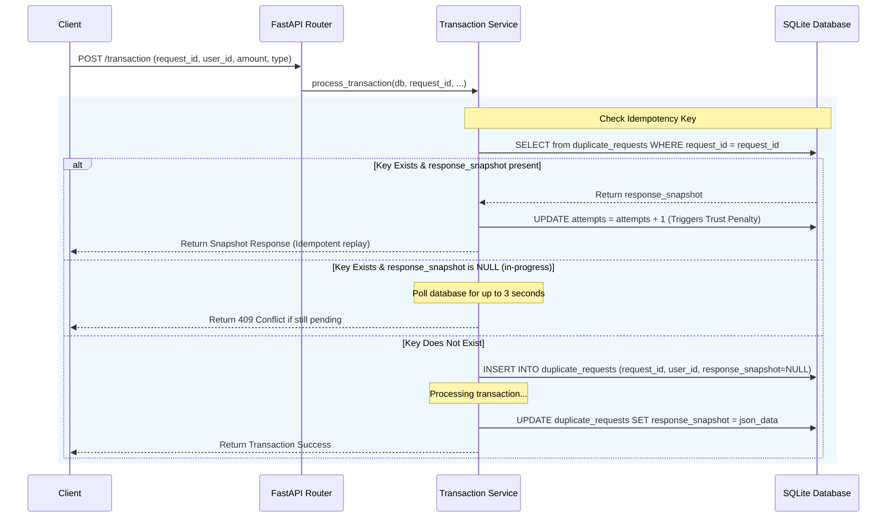

# Fair Transaction Ranking System
**[Live Demo](https://fair-transaction-frontend.vercel.app/)**

A production-quality full-stack web application designed to demonstrate secure transaction processing, strict duplicate request prevention, concurrency safety, and a mathematical fairness-based user ranking leaderboard.

---

## 1. Project Overview

The Fair Transaction Ranking System is a secure ledger dashboard. It processes credit and debit events while ensuring that users are ranked on a leaderboard using a multi-factor mathematical formula rather than just account balances. The system features a modern light-theme React dashboard on the frontend, and a high-performance FastAPI server backed by SQLAlchemy and SQLite (WAL mode) on the backend.

---

## 2. Architecture Explanation

The project is structured according to professional engineering guidelines:

```text
backend/
├── app/
│   ├── main.py                 # FastAPI Application Entrypoint & CORS/Handlers
│   ├── database.py             # Database connections, SessionLocal, and SQLite WAL settings
│   ├── models.py               # SQLAlchemy Database Models (User, Transaction, UserMetrics, etc.)
│   ├── schemas.py              # Pydantic validation schemas (TransactionCreate, LeaderboardResponse, etc.)
│   ├── services/
│   │   └── transaction_service.py # Transaction processing, Row Locking, and Idempotency key evaluation
│   └── ranking/
│       └── engine.py           # Multi-factor mathematical scoring and abuse penalties
├── tests/
│   └── test_backend.py         # Pytest suite for unit/integration/concurrency tests
└── requirements.txt            # Python dependencies

frontend/
├── src/
│   ├── App.jsx                 # React Dashboard Layout, Axios calls, and State Management
│   ├── index.css               # Design system, Outfit Typography, Animations, and Layout Grid
│   └── main.jsx                # React Entrypoint
├── package.json                # Frontend packages (Axios, React, Vite)
└── vite.config.js              # Vite server config
```

* **Frontend Layer (React + Vite):** A responsive, single-page dashboard built with state variables for real-time validation and Axios integrations.
* **API Layer (FastAPI):** Exposes high-speed JSON endpoints, enforces rate-limiting via SlowAPI, and implements global exception handling to normalize all validation/ValueError responses to the required `{ "success": false, "error": "msg" }` structure.
* **Service Layer:** Decoupled business logic separating transaction ledger operations (`transaction_service.py`) from metric calculations (`engine.py`).
* **Database Layer (SQLAlchemy ORM):** Employs relational tables with unique constraints, indexes, cascade deletions, and explicit transactional boundaries.

---

## 3. Setup Instructions

### Prerequisites
* Python 3.10+
* Node.js 18+ & npm

### Backend Setup
1. Navigate to the backend directory:
   ```bash
   cd backend
   ```
2. Install Python dependencies:
   ```bash
   pip install -r requirements.txt
   ```
3. Start the FastAPI Uvicorn server:
   ```bash
   python -m uvicorn app.main:app --reload --port 8000
   ```
   * The API server will start at `http://localhost:8000`.
   * The SQLite database file `fair_transaction.db` will be initialized automatically in the `backend/` root directory.

### Running Backend Tests
* Run the test suite:
  ```bash
  python -m pytest tests/
  ```

### Frontend Setup
1. Open a new terminal and navigate to the frontend directory:
   ```bash
   cd frontend
   ```
2. Install node dependencies:
   ```bash
   npm install
   ```
3. Start the Vite development server:
   ```bash
   npm run dev
   ```
   * Open your browser and navigate to `http://localhost:5173`.

---

## 4. API Documentation

### 1. `POST /transaction`
Creates a transaction (credit or debit) for a user.

* **Request Body:**
  ```json
  {
    "request_id": "unique-idempotency-key",
    "user_id": "user_123",
    "amount": 250.0,
    "type": "credit"
  }
  ```
* **Validation Rules:**
  * `request_id` (string, required): Cannot be empty.
  * `user_id` (string, required): Cannot be empty.
  * `amount` (float, required): Must be $> 0$ and $\le 100,000$.
  * `type` (string, required): Must be either `"credit"` or `"debit"`.
* **Response (Success):**
  ```json
  {
    "success": true,
    "transaction_id": "txn_3ab49ef2",
    "new_balance": 1250.0
  }
  ```
* **Response (Conflict/Error):**
  ```json
  {
    "success": false,
    "error": "Validation Error in body -> amount: Amount must be greater than 0"
  }
  ```

### 2. `GET /summary/{userId}`
Retrieves a detailed financial and scoring summary for a specific user.

* **Response:**
  ```json
  {
    "user_id": "user_123",
    "balance": 1250.0,
    "total_transactions": 6,
    "total_credits": 1500.0,
    "total_debits": 250.0,
    "ranking_score": 78.42
  }
  ```

### 3. `GET /ranking`
Retrieves the leaderboard ordered by fairness-based ranking score.

* **Response:**
  ```json
  {
    "success": true,
    "leaderboard": [
      {
        "rank": 1,
        "user_id": "user_123",
        "balance": 1250.0,
        "ranking_score": 78.42
      }
    ]
  }
  ```

---

## 5. Ranking Algorithm Explanation

The **Ranking Score (0–100)** is computed as a weighted average:
$$\text{Ranking Score} = 0.40 \times S_{\text{balance}} + 0.30 \times S_{\text{consistency}} + 0.20 \times S_{\text{activity}} + 0.10 \times S_{\text{trust}}$$

### 1. Balance Score ($S_{\text{balance}}$) - 40% Weight
To maintain ranking fairness and prevent extremely wealthy users from completely dominating, the balance is log-scaled using exponential saturation:
$$S_{\text{balance}} = 100 \times \left(1 - e^{-\text{balance} / 5000}\right)$$
* A balance of $\$5,000$ yields a score of $\approx 63.2$.
* A balance of $\$15,000$ yields a score of $\approx 95.0$.

### 2. Consistency Score ($S_{\text{consistency}}$) - 30% Weight
Consistency measures regular interaction rather than transactional surges. We calculate the time intervals $I$ (in seconds) between sequential transactions:
* If a user has $< 2$ transactions, $S_{\text{consistency}} = 0$.
* If the mean interval is $< 5.0$ seconds (identifying rapid automated script/bot activity), the score is penalized to $0.0$.
* Otherwise, we calculate the Coefficient of Variation ($CV = \frac{\sigma}{\mu}$), where $\sigma$ is the standard deviation of intervals and $\mu$ is the mean interval.
$$S_{\text{consistency}} = \frac{100.0}{1.0 + CV}$$
* Perfect equal spacing results in $CV = 0 \to S_{\text{consistency}} = 100$.

### 3. Activity Score ($S_{\text{activity}}$) - 20% Weight
A simple metric reward for participation:
$$S_{\text{activity}} = \min(100.0, \text{total\_transactions} \times 5)$$
* 20 valid transactions are required to achieve the full 100 points.

### 4. Trust Score ($S_{\text{trust}}$) - 10% Weight
Starts at 100.0. Features active abuse prevention deductions and rewards:
* **Spike Penalty:** $-15.0$ for each transaction amount exceeding $\$50,000$.
* **Duplicate Attempt Penalty:** $-10.0$ for every repeat submission of an existing `request_id` (calculated as `attempts - 1`).
* **Bot Penalty:** $-20.0$ for every transaction placed less than 5 seconds after the previous one.
* **Spam Spike Penalty:** $-30.0$ if the user executes more than 10 transactions in any rolling 60-second window.
* **Consistency Reward:** $+10.0$ (capped at 100.0) if a user has at least 5 transactions and zero penalties.

---

## 6. Duplicate Prevention Strategy

Idempotency is enforced using a database-backed table `duplicate_requests` that maps a unique constraint on `request_id`:



---

## 7. Concurrency Handling Approach

To prevent race conditions (such as double-spending debits or lost-update credits) when multiple API workers process transactions for the same user concurrently:
1. **Row-Level Locking:** We query the user row inside a transaction using `with_for_update()`:
   ```python
   user = db.query(User).filter(User.user_id == user_id).with_for_update().first()
   ```
   * In PostgreSQL/MySQL, this blocks concurrent workers requesting the same user row until the lock-holding transaction commits or rolls back.
2. **SQLite WAL Mode & Retries:** Because SQLite uses database-wide write locks, concurrent writes can raise an `OperationalError` ("database is locked"). We handle this by using SQLite in **Write-Ahead Logging (WAL)** mode (allowing concurrent reads while writing) and implementing a **retry loop with exponential backoff** in python code.
   * If a lock contention happens, the worker rolls back, sleeps for a short jittered duration, and tries again. Our concurrency tests prove this ensures zero lost updates.

---

## 8. Trade-offs and Limitations

* **Database Locking Bottlenecks:** Row-level locks (`with_for_update`) block concurrent updates to the same user. While this ensures perfect consistency, it limits transaction throughput for a single user to the write speed of the database. For highly active global accounts, an event-sourcing ledger or Redis-based distributed locking before entering the DB layer might be necessary.
* **SQLite for Concurrency Demo:** SQLite is a file-based database. Although WAL mode and retry loops are active, SQLite remains inferior to PostgreSQL for production environments with high write volumes. In production, `DATABASE_URL` should be pointed to a PostgreSQL instance.
* **In-Memory Rate Limiting:** The SlowAPI middleware currently rate-limits requests based on an in-memory memory cache. In multi-worker production deployments (e.g., Uvicorn running multiple processes behind a load balancer), a Redis backend should be passed to the SlowAPI Limiter to share rate limit state.
